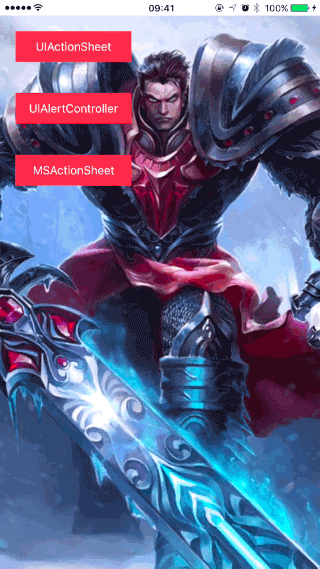

# MSActionSheet

仿微信和新浪微博风格的 ActionSheet，使用方便，源码简单易读。

## 演示



## 系统要求

* `iOS5` 及以上。
* Automatic Reference Counting(ARC)

## 安装

#### CocoaPods
1. 在 Podfile 中添加 `pod 'MSActionSheet'`。
2. 执行 `pod install` 或 `pod update`。
3. 导入头文件：`#import <MSActionSheet.h>`。

#### 手动安装
1. 下载 MSActionSheet 项目。
2. 将 `MSActionSheet` 文件夹中的源文件拽入项目中。
3. 导入头文件：`#import "MSActionSheet.h"`。

## 使用

#### 1. 创建和使用 MSActionSheet
**和创建 UIActionSheet 的代码类似，只是把响应按钮的方式由代理的方式改为了 blocks 的方式，并提供了3种初始化方法。如下：**

最简单的 actionSheet，只有取消按钮和普通按钮

```
+ (instancetype)actionSheetWithCancelButtonTitle:(NSString *)cancelButtonTitle
                               otherButtonTitles:(NSArray<NSString *> *)otherButtonTitles
                               clickButtonHandle:(void (^)(MSActionSheet *ms_actionSheet, NSUInteger clickButtonAtIndex))clickButtonHandle;
```

有特殊按钮的 actionSheet，特殊按钮颜色默认为红色

```
+ (instancetype)actionSheetWithCancelButtonTitle:(NSString *)cancelButtonTitle
                               otherButtonTitles:(NSArray<NSString *> *)otherButtonTitles
                          destructiveButtonIndex:(NSInteger)destructiveButtonIndex
                               clickButtonHandle:(void (^)(MSActionSheet *ms_actionSheet, NSUInteger clickButtonAtIndex))clickButtonHandle;
```

带有标题和内容的 actionSheet 

```
+ (instancetype)actionSheetWithTitle:(id)title
                             message:(id)message
                   cancelButtonTitle:(NSString *)cancelButtonTitle
                   otherButtonTitles:(NSArray<NSString *> *)otherButtonTitles
              destructiveButtonIndex:(NSInteger)destructiveButtonIndex
                   clickButtonHandle:(void (^)(MSActionSheet *ms_actionSheet, NSUInteger clickButtonAtIndex))clickButtonHandle;
```

**创建对象后使用 `- (void)showInWindow` 方法显示。**

#### 2. 支持部分自定义

**修改相应的宏定义的值即可，支持自定义的部分如下：**

```
#pragma mark - 自定义 UI 样式
#pragma mark -

/// 空白处的背景颜色
#define MSActionSheet_Blank_BackgroundColor [UIColor colorWithWhite:0 alpha:0.4]

/// 标题字体颜色
#define MSActionSheet_Title_Font_Color [UIColor colorWithRed:(120/255.f) green:(120/255.f) blue:(120/255.f) alpha:1.f]
/// 标题字体大小
#define MSActionSheet_Title_Font_Size [UIFont boldSystemFontOfSize:13.f]

/// 内容字体颜色
#define MSActionSheet_Message_Font_Color MSActionSheet_Title_Font_Color
/// 内容字体大小
#define MSActionSheet_Message_Font_Size [UIFont systemFontOfSize:13.f]

/// 按钮字体大小
#define MSActionSheet_ButtonTitle_Font_Size [UIFont systemFontOfSize:18.f]
/// 取消按钮字体颜色
#define MSActionSheet_CancelButtonTitle_Font_Color [UIColor blackColor]
/// 其他按钮字体颜色
#define MSActionSheet_OtherButtonTitle_Font_Color MSActionSheet_CancelButtonTitle_Font_Color
/// 特殊按钮字体颜色
#define MSActionSheet_DestructiveButtonTitle_Font_Color [UIColor redColor]
/// 按钮的高度
#define MSActionSheetButtonCell_Height (42.f*[UIScreen mainScreen].bounds.size.width/320.f)

/// 线的颜色
#define MSActionSheet_Line_Color [UIColor colorWithRed:(136/255.f) green:(136/255.f) blue:(136/255.f) alpha:1.f]

/// iOS 8 及以上版本支持
/// 背景是否有模糊效果，非 0 为有
#define MSActionSheet_BG_IsBlurEffectStyle 1

/// iOS 7 及以下版本 或者 没有模糊效果时修改下面的宏定义的值有效
/// 选中按钮时的背景颜色
#define MSActionSheet_Button_SelectedColor [UIColor colorWithRed:(192/255.f) green:(192/255.f) blue:(192/255.f) alpha:1.f]
/// 内容部分的背景颜色
#define MSActionSheet_Content_BackgroundColor [UIColor whiteColor]

#pragma mark -
```

## 许可证

MSActionSheet 使用 MIT 许可证，详情见 LICENSE 文件。

***

## 原理
实现一个 UIView 的子类，其内容使用 UITableView 来实现类似微信 ActionSheet 的 UI 样式。显示 ActionSheet 就是把自定义的 View 添加到 window 上。

## 细节
1. 项目中使用 UITableView 来实现 AcitonSheet 的样式。这里只是用到了 UITableView 的分组特性，其他的如滑动和 cell 的重用等这些特性并没有用到。所以也可以使用 UIButton 来一个一个铺出来，而且我认为这种方式会比使用 UITableView 的方式好一些。因为图层会比较简单不会有一些多余的东西，之后的版本会考虑使用这种方式来优化。

2. 项目中使用了很多宏定义来提供 UI 样式的自定义。为什么不把他们写成属性呢？因为我觉得 UIActionSheet 的样式在一个 App 中都是一样的。所以不需要动态的去设置它的样式。所以就使用了宏定义这种静态的方式。

3. 项目中使用了 blocks 来进行交互。因为我觉得 ActionSheet 是显示在 window 上的，也就是说显示 ActionSheet 后，就必须对它做出操作，要么取消，要么选择某个 item。所以在显示完 ActionSheet 之后会立即处理对它操作的回调，如果在回调中使用到了某个局部变量的话，使用 blocks 就特别的方便，使用代理方式的话就需要使用一个全局变量来保存这个局部变量，所以很不方便。这也是我对使用 blocks 还是代理的理解，弹窗也很适合使用 blocks 来进行交互，因为它也是显示出来后必须对它进行操作（要么关闭要么选择某个操作后关闭）才能去做其他操作。

## 感受
在做项目之前，先去参考了 github 上的 start 比较多的项目。主要是看看他们的实现方式，然后和自己的实现方式比较，然后优化自己的实现方式。其中发现有的项目功能很强大，几乎所有的 UI 样式都可以自定义，但是项目的代码量也比较大，所以比较复杂。我个人对代码的追求是“代码简单，功能强大”。当两者出现矛盾的时候，我更倾向于代码简单。我觉得可以满足大部分情况就可以了，如果遇到了一些比较不常见的情况还是自己 fork 下来修改成自己的比较好，这样就不会有很多自己用不到的代码。代码的可读性和可维护性会更好。

还有一点就是对提供宏定义的方式和使用属性的方式来实现对项目的自定义的认识。前者是静态的，后者是动态的。
